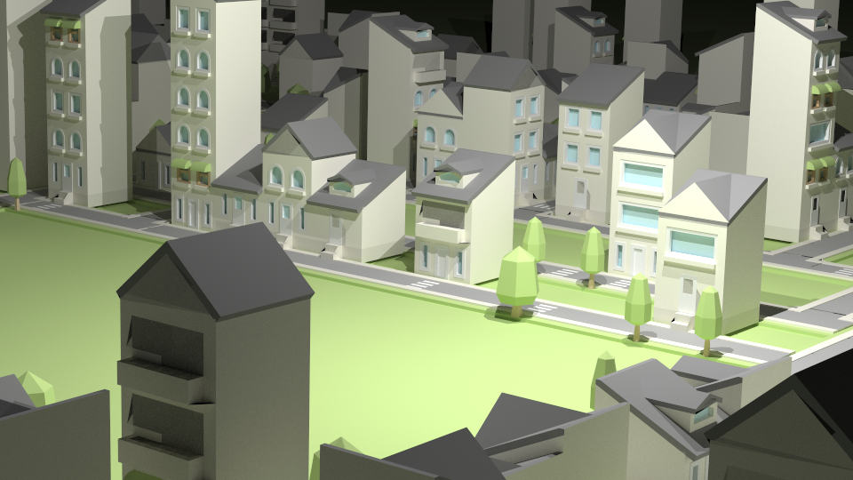
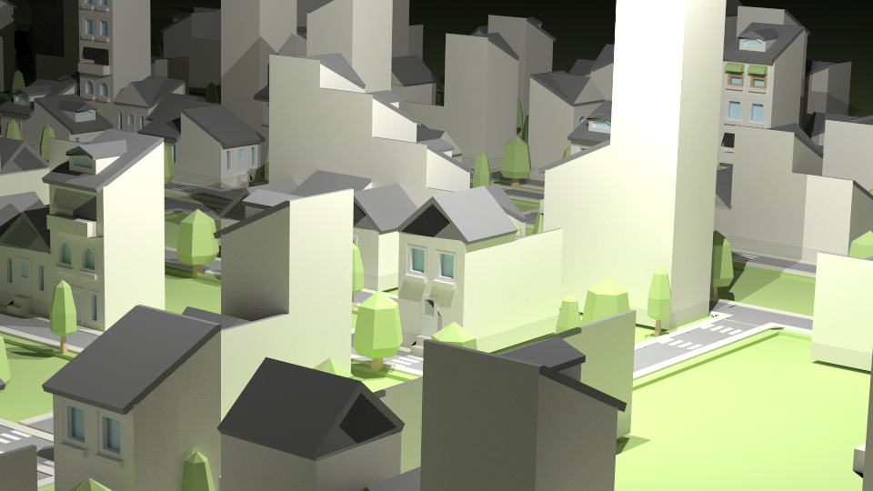

# Cities-Generator
Cities generator based on Yocto/GL Library. It generates random cities using context-free grammars.
This project is repository version of my yocto-gl [Fork](https://github.com/antoniomuso/yocto-gl).


## Images





## Getting Started
```
git clone --recursive https://github.com/antoniomuso/cities-generator.git
```
How to build.
```
mkdir build; cd build; cmake ..; cmake --build .
```
To run application
```
cd ..
./bin/build_generator
```
You can use option **-d** to change dimension of cities, default 50, and **-o** to change filename of output.
```
./bin/build_generator -d 100 -o myFile.obj
```

### Prerequisites

To Build you need of [OpenGL](http://freeglut.sourceforge.net/), [Glew](http://glew.sourceforge.net/) and [Glfw](http://www.glfw.org/) 

### Installing
You can install dependencis on Ubuntu with the following commands:
```
sudo apt-get update
sudo apt-get install freeglut3 freeglut3-dev
sudo apt-get install libglew-dev
sudo apt-get install libglfw3-dev
```


## License

This project is licensed under the MIT License - see the [LICENSE](LICENSE.md) file for details
