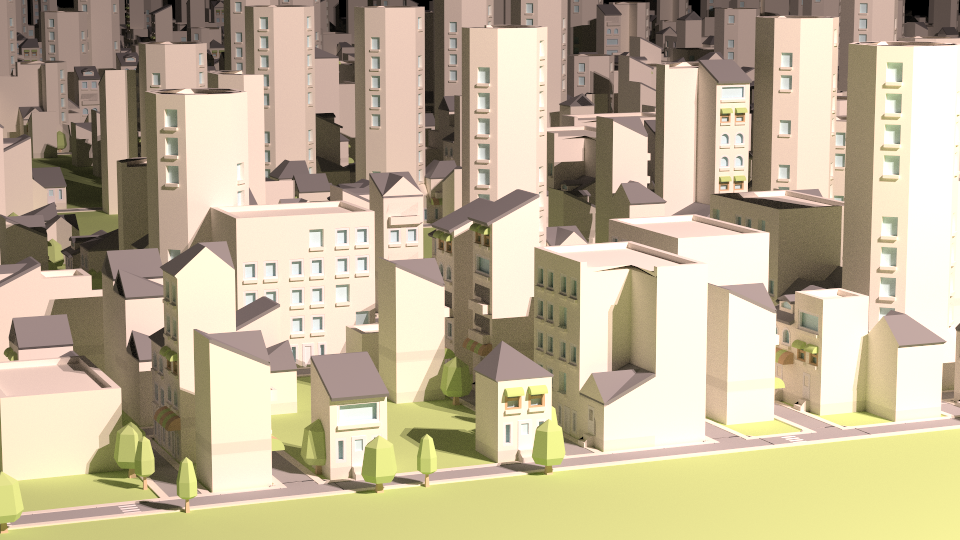
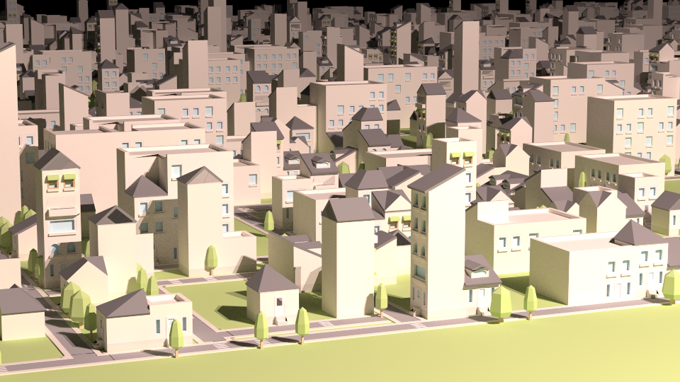
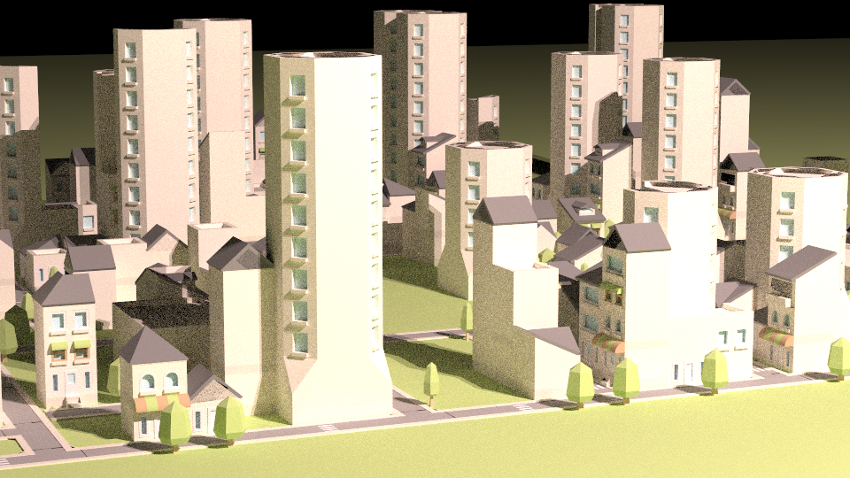
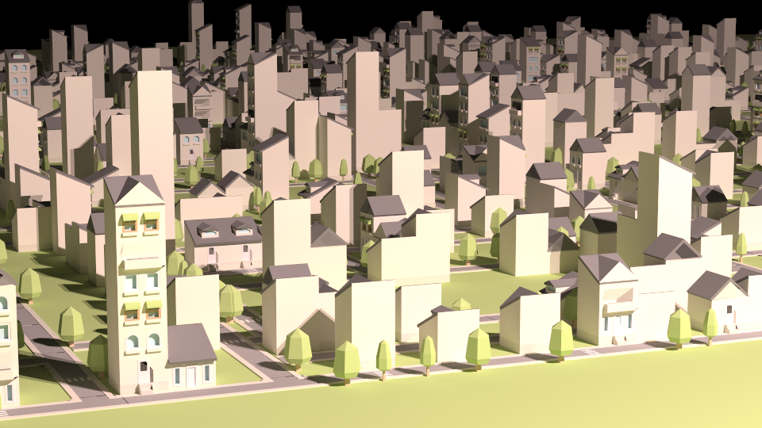

# Cities-Generator
Cities generator based on [Yocto/GL](https://github.com/xelatihy/yocto-gl) Library. It generates random cities using context-free grammars.
This project is repository version of my yocto-gl [Fork](https://github.com/antoniomuso/yocto-gl).

The repository provides the user with a specialized grammar for a block-construction.
The grammar features:
- Methods for objects positioning in scene.
- Methods for rotation.
- Methods for scaling.
- Methods for avoiding collisions of objects.

The variables of grammar are called nodes, inside nodes there are the shapes of the object bound to the node.
The nodes can be empty and, in this case, they become support variables for the grammar.
The nodes will be added to graph struct that represents the grammar.
Rules of grammar are of this type `A := B | C | D ` this meaning that the node `A` can be replaced with the node `B` or node `C` or `D`, The variable selection is random in the algorithm. it is possible to do a substitution with more variables ` B := C and D | C and B ` this means that `B` can be replaced with `C` and `D`, or with `C` and `B`. 
The grammar costruction is based on three principal methods:
- **loadNode**: it takes a path of .obj in input and returns a node.
- **add_multi_nodes_or**: it takes a node `A` and a set of nodes B<sub>n</sub> (with relative costants)and creates the following rule A := .. | B | B<sub>1</sub> | ... | B<sub>n</sub>. If a rule for `A` exists, it merges the old rule with the new.
- **add_multi_nodes_and**: it takes a node `A` and a set of nodes B<sub>n</sub> and creates the following rule A := .. | B<sub>1</sub> and B<sub>2</sub> and ... B<sub>n</sub>


## Images
This Images have been rendered with [Yocto/GL PathTracer](https://github.com/xelatihy/yocto-gl/blob/master/apps/ytrace.cpp)
```/bin/builder -d 150```

```/bin/builder -d 100```






You can found other images in [Images folder](Images)


## Getting Started
``` shell
git clone --recursive https://github.com/antoniomuso/cities-generator.git
``` 
How to build.
``` shell
mkdir build; cd build; cmake ..; cmake --build .
```
To run application
``` shell
cd ..
./bin/builder
``` 
You can use option **-d** to change cities dimension, default 50, and **-o** to change output filename.
``` shell
./bin/builder -d 100 -o myFile.obj
```

### Prerequisites

To Build you need of [OpenGL](http://freeglut.sourceforge.net/), [Glew](http://glew.sourceforge.net/) and [Glfw](http://www.glfw.org/)

### Installing
You can install dependencis on Ubuntu with the following commands:
``` shell
sudo apt-get update
sudo apt-get install freeglut3-dev
sudo apt-get install libglew-dev
sudo apt-get install libglfw3-dev
```
You need last gcc version, you can install it [here](https://gist.github.com/application2000/73fd6f4bf1be6600a2cf9f56315a2d91)


## Authors

* **Antonio Musolino** - [antoniomuso](https://github.com/antoniomuso)


## License

This project is licensed under the MIT License - see the [LICENSE](LICENSE) file for details
