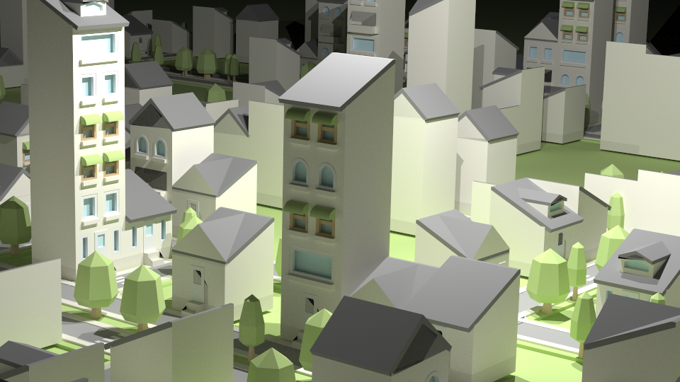
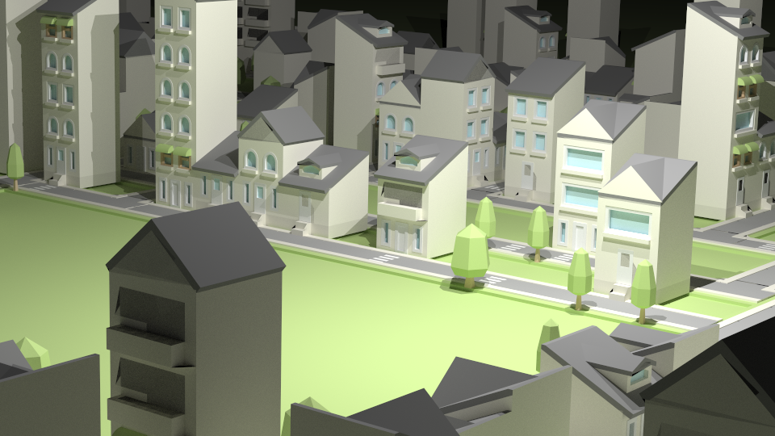
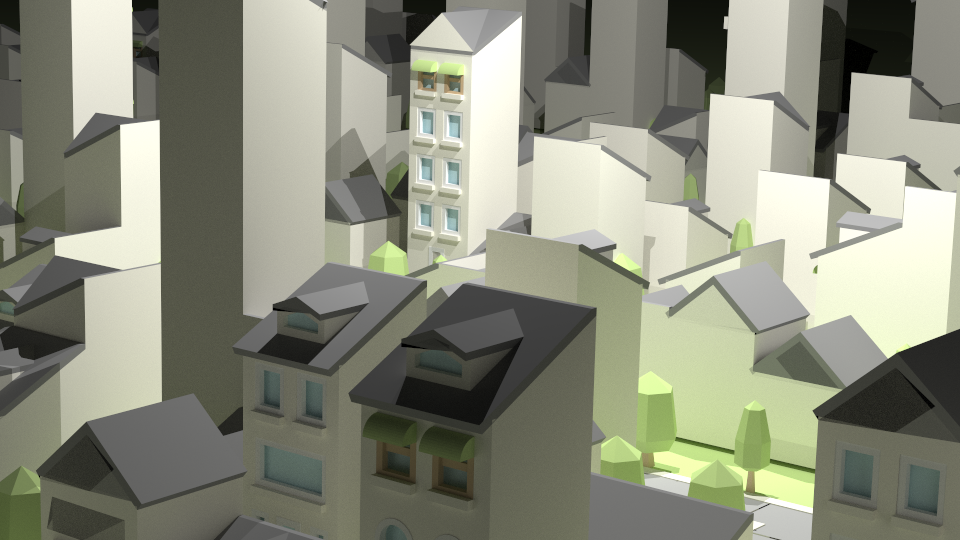
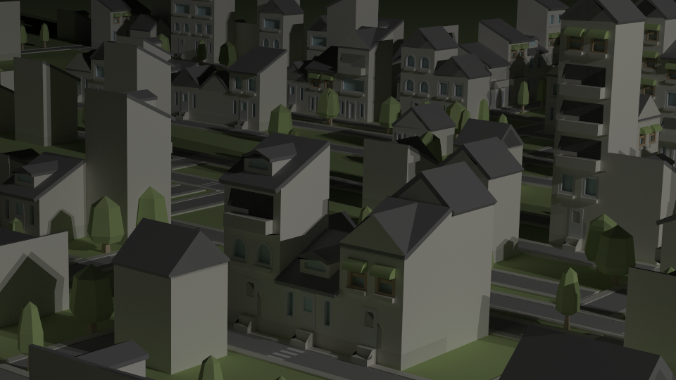

# Generatore Città

## La Grammatica Usata
Il progetto usa una grammatica context-free specializzata per la costruzione a blocchi delle città, le caratteristiche della grammatica sono:
- Metodi per posizionare gli oggetti nella scena.
- Metodi per ruotare gli oggetti nella scena.
- Metodi per lo scaling.
- Metodi per evitare collisioni di istanze.
- Metodi per gestire la profondità di sostituzione variabili.

Le variabili della grammatica nel codice sono chiamati nodi, dentro un nodo abbiamo le shape dell'oggetto legato al nodo.
I nodi possono anche essere vuoti, e in questo caso potranno essere usati come variabili terminali oppure come variabili di appoggio.
La struttura Graph rappresenta la grammatica, li verranno aggiunti i nodi.
Le regole della grammatica sono legate al nodo stesso, e sono del tipo `A := B | C | D`, ovvero il nodo `A` può essere sostituito con uno dei nodi alla sua destra. La selezione del nodo da sostituire viene effettuata in maniera randomica. E' possibile effettuare la sostituzione con più variabili in contemporannea ovvero `B := C and D | C and B and N`.

La grammatica si basa su questi principali metodi:
- **loadNode**: Prende in input un path di un .obj, la scena e una mappa dei materiali. Restituisce un Nodo che rappresenta l'obj passato in input. 
- **add_multi_nodes_or**: Prende in input un Nodo, la grammatica, e poi un insieme di nodi per la sostituzione (con le relative costanti),tutti i nodi dell'insieme vengono messi in **OR** fra di loro nella regola di sostituzione per il Nodo di input.
- **add_multi_nodes_and**: Prende in input un Nodo, la grammatica, e poi un insieme di nodi per la sostituzione (con le relative costanti), tutti i nodi vengono messi in **AND** fra di loro come regola di sostituzione del Nodo di input. La regola viene concatenata tramite **OR** con qualsiasi altra regola aggiunta per lo stesso nodo.
- **callBuild**: Prende in input la scena, il graph, il frame da dove iniziare la generazione e le dimensioni per limitare la generazione. Costruisce la scena usando la grammatica.

## Costruzione Della Città

La città è stata costruita usando la grammatica precedente, il codice che costruisce le regole per la generazione della città si trova nei metodi: 
- **build_graph_houses** Sinteticamente e formalmente la grammatica per la costruzione delle case:
```
Casa := Base
Base := Piano | Tetto
Piano := Piano | Tetto
```
- **build_roads** Sinteticamente e formalmente la grammatica per la costruzione delle strade:
```
StradaDritta := StradaDritta | StradaDritta and Casa | StradConCurva 
StradaConCurva := StradaDritta
```


## Immagini
Tutte le immagini sono state renderizzate con [Yocto/GL PathTracer](https://github.com/xelatihy/yocto-gl/blob/master/apps/ytrace.cpp)








Si possono trovare altre nella cartella Image della repository ufficiale: [cities-generator](https://github.com/antoniomuso/cities-generator)

## Implementazioni Future
- [ ] Randomicità sulle costanti.
- [ ] Sostituzione con variabile in caso di collissione.
- [ ] Collissione in altezza.
- [ ] Conversione algoritmo da ricorsivo ad iterativo con pila. (Per efficenza) 
- [ ] Inserimento probabilità di scelta di una variabile.


## Authors

* **Antonio Musolino** - [antoniomuso](https://github.com/antoniomuso)

## License

This project is licensed under the MIT License - see the [LICENSE](LICENSE) file for details
